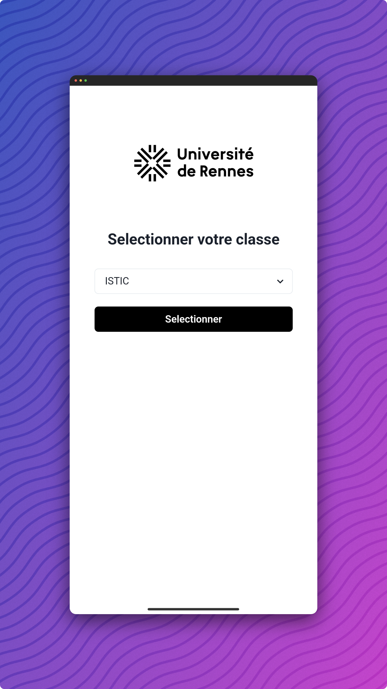
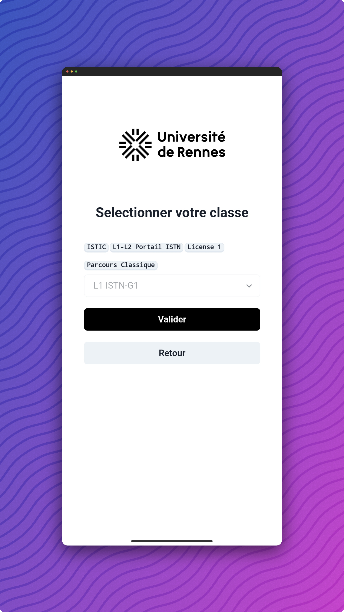
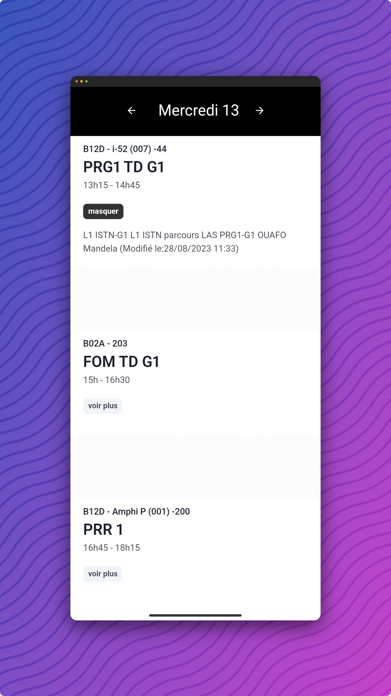
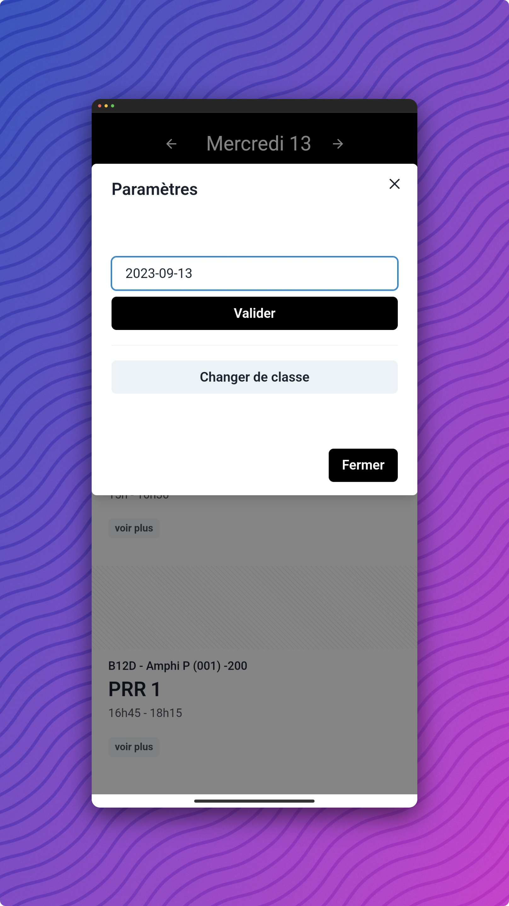

# StudyPlan


StudyPlan is a mobile application for Android that retrieves a university's timetable. For the moment the App is mainly dedicated to the University of Rennes 1, but it can easily be adapted to any other school.


## Application View

|           1            |              2              |
| :--------------------: | :-------------------------: |
|  |  |

|             3              |             4              |
| :------------------------: | :------------------------: |
|  |  |


## How to add a university?

### Setup & Start the application is dev mode

```bash
npm i &&  npm run dev
```

### Modify app urls

> ./src/components/api.tsx

```js
const BASE_URL = /* change the base url */;
const PROJECT_ID = /* change the project id */;
const CALENDAR_URL = `https://${BASE_URL}/jsp/custom/modules/plannings/anonymous_cal.jsp`
```

### Edit tree data (JSON)

> ./src/assets/tree.json

```json

"<parent>": {
        "<parent>": {
            "<parent>": {
                "<item>": /* resource id */,
                "<item>": 2951,
                "<parent>": {
                    "<item>": 2924,
                    "<item>": 2937,
                    "<item>": 2926
                },
```

### Change university logo (SVG)

> ./src/assets/logo.svg


### Build

```bash
npm run build && npx cap open android
```

Now you can compile your application into Release version (APK/Bundle) in AndroidStudio.